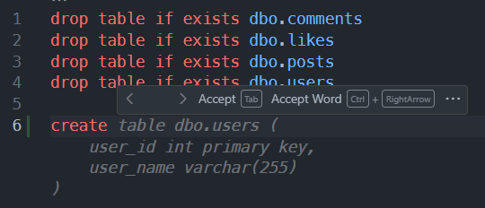
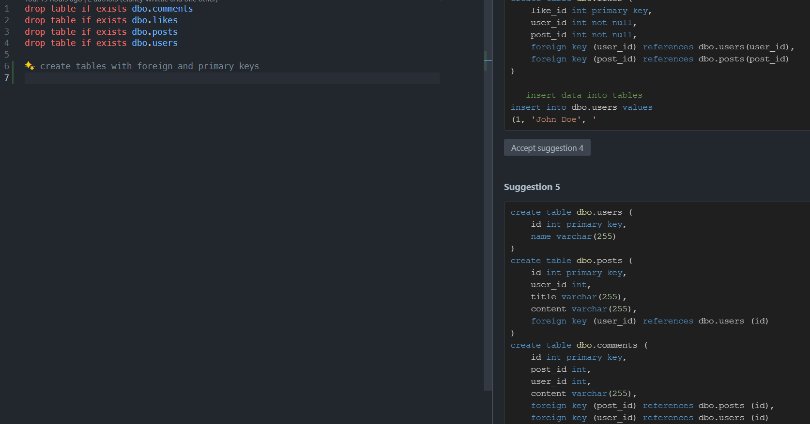
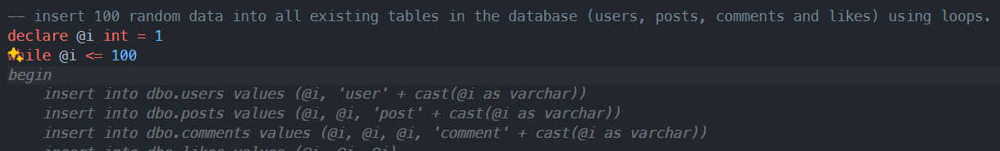
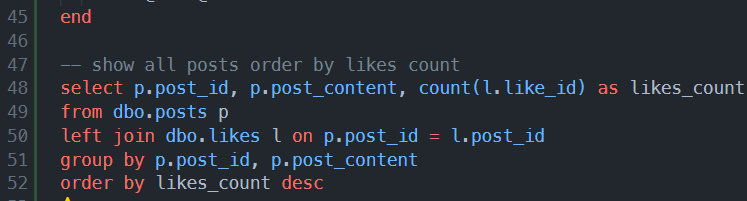
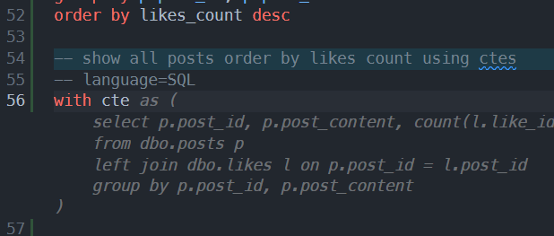

# Workshop exercises

## DataOps Exercises

The following exercises are designed to help you get started with DataOps using Copilot in Azure Data Studio. You must of completed the [setup instructions](1.setup.md) before you can complete these exercises.

## Step by step instructions

1. Open the `sql-demo.sql` if it's not already open in the editor.
2. Enter a new line after the last drop last drop table statement.
3. On the next line we're going to prompt GitHub Copilot to suggest code for us by typing `create`. GitHub Copilot auto complete should show now produce ghost text creating the table.

   

4. Keep pressing `tab` until all four tables are created (user, posts, likes, comments).
5. `Delete` all the tables you just added. Let's now create the same tables but this time using a comment to provide more context for GitHub Copilot.
6. Add a new comment `-- create tables with foreign and primary keys` after the last drop table statement.
7. Open `GitHub Completion Panel` (CTRL+ENTER) to see all suggestions and accept the suggestion with tables containing primary/foreign keys. This shows how you can provide a starting point and GitHub Copilot can provide suggestions based on that context.

   

8. Add a new line after the last code snippet and add comment `-- insert 100 random data into all existing tables in the database (users, posts, comments and likes) using loops`.
9. Keep pressing `tab` until code is complete.

   

10. Add a new line after the last code snippet and add comment `-- show all posts order by likes count`.
11. Keep pressing `tab` until code is complete. In some cases the suggestion may not be exactly what you want and contain order/group statements.This is where you can provide more context by adding a comment to help GitHub Copilot provide better suggestions or can manually add keywords like `order` to prompt GitHub Copilot to suggest the correct code.

    

12. Add a new line after the last code snippet and add comment `-- show all posts order by likes count`.
13. Add a new line and add comment `-- language=SQL` to specify the language for the code snippet and another way we can provide more context to GitHub Copilot.
14. Type `with cte` and ghost text should appear, keep pressing `tab` until code is complete. This shows how you can provide a starting point and GitHub Copilot can provide suggestions based on that context.

    

You can refer to [sql-demo-example-output.sql](../sql-demo-example-output.sql) to see examples of the expected code outputs.

> Remember, GitHub Copilot is probabilistic so you may not get the exact same code suggestions as we did. If you're not happy with the suggestions, you can always press CTRL + Z to undo the changes and try again.
