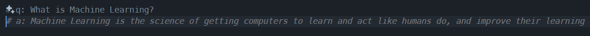
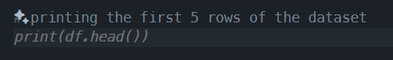
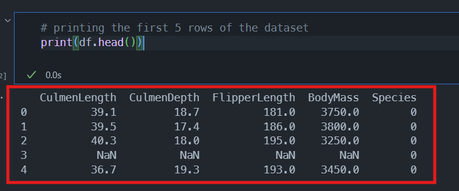
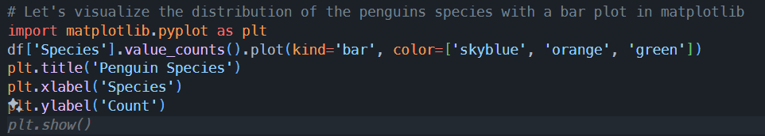
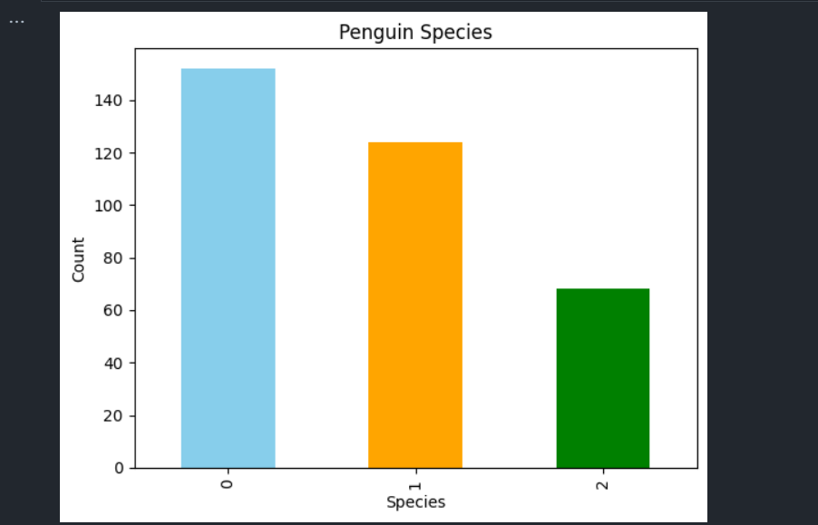
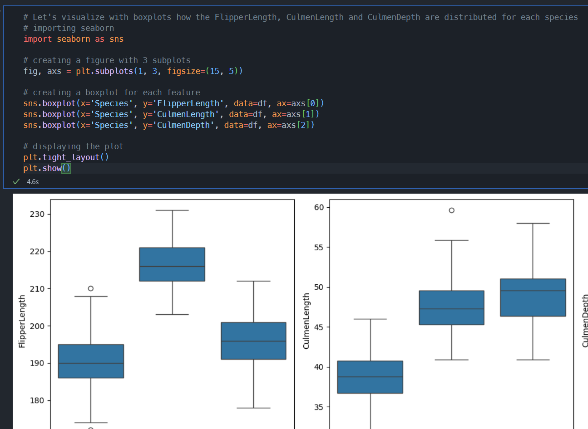

# Workshop exercises

## Machine Learning Exercises

The following exercises are designed to help you get started with Machine Learning using GitHub Copilot in `VSCode`. You must of completed the [setup instructions](1.setup.md) before you can complete these exercises.

## Step by step instructions

First, we are going to work with a Jupyter notebook that contains questions and answers about Machine Learning. This notebook is designed to help you understand the basics of Machine Learning and how to use GitHub Copilot to help you with questions and answers.

1. Open the `ml-q&a-demo.ipynb` if it's not already open in the editor.
2. Scroll down to the first question and enter a new line. GitHub Copilot auto complete should show now produce ghost text with the suggestion.

   

3. Repeat the same process for the remaining questions. GitHub Copilot should provide suggestions for each question and provide you with a better understanding of the topic.

Now we are going to work with a dataset about penguins. This dataset contains information about the species of penguins and their physical characteristics. We are going to use this dataset to train a Machine Learning model to predict the species of a penguin based on its physical characteristics.

1. Open the `ml-penguin-demo.ipynb` if it's not already open in the editor.
2. Scroll down to `# printing the first 5 rows of the dataset` and enter a new line. GitHub Copilot auto complete should produce ghost text with the suggestion.

   

3. Click the `Run All` button to execute the code and see the output.

   

4. Scroll down to `# Let's visualize the distribution of the penguins species with a bar plot in matplotlib` and enter a new line. GitHub Copilot auto complete should show now produce ghost text with the suggestion. Continue to press `tab` until the code is complete.

   

5. Click the `Run All` button to execute the code to see the bar plot output.

   

6. Scroll down to `# Let's visualize with boxplots how the FlipperLength, CulmenLength and CulmenDepth are distributed for each species` and enter a new line. GitHub Copilot auto complete should show now produce ghost text with the suggestion. Continue to press `tab` until the code is complete.
7. Click the `Run All` button to execute the code to see the boxplot output.

   

8. Repeat the same process for the remaining code cells in the notebook. GitHub Copilot should provide suggestions for each code cell and guide you through the process of training a Machine Learning model to predict the species of a penguin based on its physical characteristics.

You can refer to [ml-penguin-demo-example-output.ipynb](../ml-penguin-demo-example-output.ipynb) to see examples of the expected code outputs.

> Remember, GitHub Copilot is probabilistic so you may not get the exact same code suggestions as we did. If you're not happy with the suggestions, you can always press CTRL + Z to undo the changes and try again.
